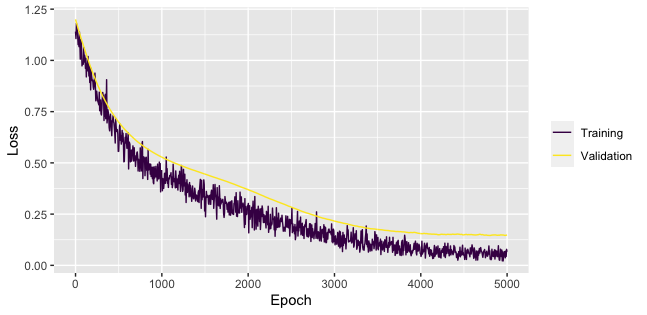
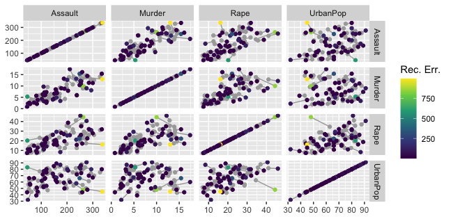

# :zap: ANN2

[](https://app.codacy.com/gh/bflammers/ANN2?utm_source=github.com&utm_medium=referral&utm_content=bflammers/ANN2&utm_campaign=Badge_Grade)
[](https://www.gnu.org/licenses/gpl-3.0.en.html)
[](https://cran.r-project.org/package=ANN2)


[](https://codecov.io/gh/bflammers/ANN2)

Artificial Neural Networks package for R

This package allows to train neural networks for classification and regression tasks, as well as autoencoders for anomaly detection. Several helper and plotting functions are included for improved usability and understanding what the model does.

ANN2 contains a vectorized neural net implementation in C++ that facilitates fast training through mini-batch gradient descent.

## :fire: Features

ANN2 has the following features:

-   Easy to use interface - defining and training neural nets with a single function call!
-   Activation functions: tanh, sigmoid, relu, linear, ramp, step
-   Loss functions: log, squared, absolute, huber, pseudo-huber
-   Regularization: L1, L2
-   Optimizers: sgd, sgd w/ momentum, RMSprop, ADAM
-   Plotting functions for visualizing encodings, reconstructions and loss (training and validation)
-   Helper functions for predicting, reconstructing, encoding and decoding
-   Reading and writing the trained model from / to disk
-   Access to model parameters and low-level Rcpp module methods

## :hammer_and_wrench: Usage

Defining and training a multilayer neural network with ANN2 is done using a single function call to either:

-   `neuralnetwork()` - for a multilayer neural net for classification or regression,
-   `autoencoder()` - for an autoencoding neural network that is trained to reconstruct its inputs.

Below are two examples with minimal code snippets that show how to use these functions.

### `neuralnetwork()`

We'll train a neural network with dimensions 4 x 5 x 5 x 3 on the Iris data set that classifies whether each observation (sepal length and width and petal length and width measurements for three species of floweres) belongs to class setosa, versicolor or virginica. The dimensions of the input and output layers are inferred from the data, the hidden layer dimensions are defined by providing a single vector that specifies the number of nodes for each hidden layer as argument `hidden.layers`.

```r
library(ANN2)

# Prepare test and train sets
random_idx <- sample(1:nrow(iris), size = 145)
X_train    <- iris[random_idx, 1:4]
y_train    <- iris[random_idx, 5]
X_test     <- iris[setdiff(1:nrow(iris), random_idx), 1:4]
y_test     <- iris[setdiff(1:nrow(iris), random_idx), 5]

# Train neural network on classification task
NN <- neuralnetwork(X = X_train,
                    y = y_train,
                    hidden.layers = c(5, 5),
                    optim.type = 'adam',
                    n.epochs = 5000)

# Predict the class for new data points
predict(NN, X_test)

# $predictions
# [1] "setosa"     "setosa"     "setosa"     "versicolor"     "versicolor"
#
# $probabilities
#      class_setosa class_versicolor class_virginica
# [1,] 0.9998184126     0.0001814204    1.670401e-07
# [2,] 0.9998311154     0.0001687264    1.582390e-07
# [3,] 0.9998280223     0.0001718171    1.605735e-07
# [4,] 0.0001074780     0.9997372337    1.552883e-04
# [5,] 0.0001077757     0.9996626441    2.295802e-04

# Plot the training and validation loss
plot(NN)
```



You can interact with the resulting `ANN` object using methods `plot()`, `print()` and `predict()`. Storing and loading the model to/from disk can be done using `write_ANN()` and `read_ANN()`, respectively. Other, more low-level, methods of the C++ module can be accessed through the `$` operator as members of the object, eg. `NN$Rcpp_ANN$getParams()` for getting the parameters (weight matrices and bias vectors) from the trained model.

### `autoencoder()`

The `autoencoder()` function allows to train an autoencoding neural network. In the next example we'll train an autoencoder of dimension 4 x 10 x 2 x 10 x 4 on the USArrests data set. The middle hidden layer acts as a bottleneck that forces the autoencoder to only retain structural variation and discard random variation. By denoting data points that are poorly reconstructed (high reconstruction error) as aberant, we exploit this denoising property for anomaly detection.

```r
# Prepare test and train sets
random_idx <- sample(1:nrow(USArrests), size = 45)
X_train    <- USArrests[random_idx,]
X_test     <- USArrests[setdiff(1:nrow(USArrests), random_idx),]

# Define and train autoencoder
AE <- autoencoder(X = X_train,
                  hidden.layers = c(10,3,10),
                  loss.type = 'pseudo-huber',
                  optim.type = 'adam',
                  n.epochs = 5000)

# Reconstruct test data
reconstruct(AE, X_test)

# $reconstructed
#         Murder   Assault UrbanPop      Rape
# [1,]  8.547431 243.85898 75.60763 37.791746
# [2,] 12.972505 268.68226 65.40411 29.475545
# [3,]  2.107441  78.55883 67.75074 15.040075
# [4,]  2.085750  56.76030 55.32376  9.346483
# [5,] 12.936357 252.09209 56.24075 24.964715
#
# $anomaly_scores
# [1]  398.926431  247.238111   11.613522    0.134633 1029.806121

# Plot original points (grey) and reconstructions (colored) for training data
reconstruction_plot(AE, X_train)
```



In the reconstruction plot we see the original points (grey) along with their reconstructions (color scale based on reconstruction error), connected to each other by a grey line. The length of the line denotes the reconstruction error.

You can interact with the `ANN` object that results from the `autoencoder()` function call using various methods, including `plot()`, `encode()`, `decode()` and `reconstruct()`.

More details on supported arguments to `neuralnetwork()` and `autoencoder()`, as well as examples and explanations on using the helper and plotting functions can be found in the manual.

---
